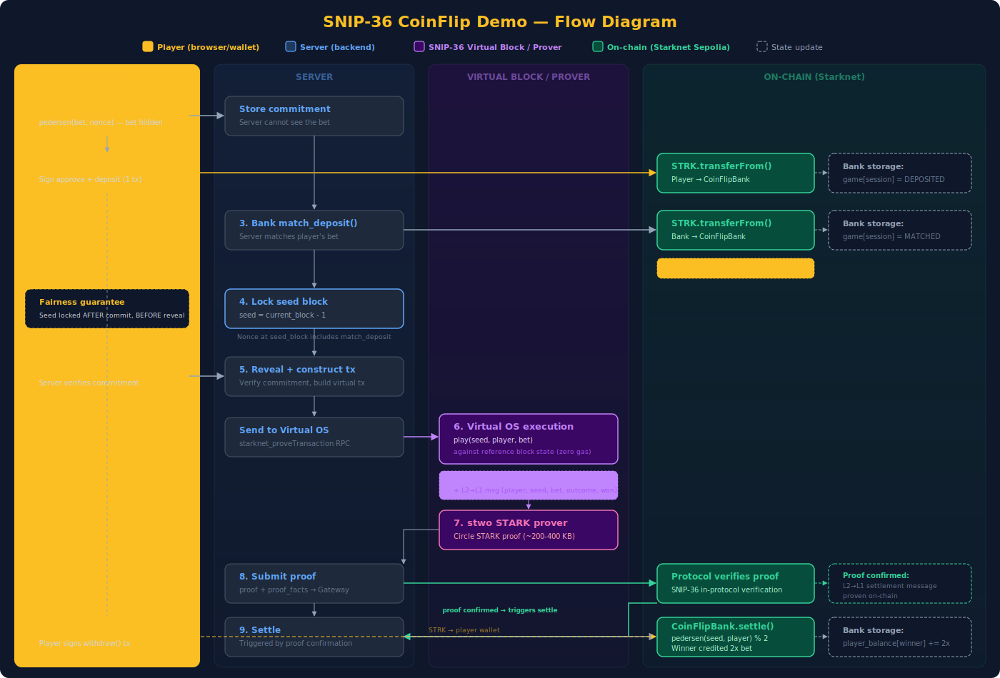

# SNIP-36 CoinFlip Demo

Provably fair coin flip game on Starknet, powered by [SNIP-36 in-protocol proof verification](https://community.starknet.io/t/snip-36-in-protocol-proof-verification/116123).

Player bets STRK, the bank matches, a coin is flipped inside a SNIP-36 virtual block, and a STARK proof guarantees the result is honest. The winner gets paid on-chain -- no trust required.

## Architecture



The diagram shows the full 9-step flow, color-coded by where each step happens:
- **Green** = on-chain (Starknet Sepolia) -- token transfers, proof verification, settlement
- **Purple** = off-chain (server) -- virtual OS execution, STARK proof generation
- **Amber** = player wallet actions -- commit, deposit, withdraw
- **Dashed** = on-chain state updates (CoinFlipBank contract storage)

## Game Flow

1. **Connect wallet** -- ArgentX or Braavos on Starknet Sepolia
2. **Choose side & amount** -- Heads or tails, 0.1-100 STRK
3. **Commit** -- Browser computes `pedersen(bet, nonce)` and sends the hash (bet stays hidden)
4. **Deposit** -- Player signs approve + deposit multicall in wallet (one signature)
5. **Bank match** -- Server matches the deposit from bank funds
6. **Prove** -- Server executes `play(seed, player, bet)` in a SNIP-36 virtual block, generates a STARK proof via the stwo prover
7. **Submit** -- Proof-bearing transaction submitted to Starknet
8. **Verify** -- Starknet protocol verifies the proof on-chain
9. **Settle** -- Settlement contract recomputes the deterministic outcome and pays the winner

## SNIP-36 Features Demonstrated

| Feature | How the game uses it |
|---|---|
| **Virtual blocks** | Coin flip executes off-chain with zero gas cost |
| **STARK proof verification** | stwo proof guarantees honest computation |
| **L2-to-L1 settlement messages** | Game result emitted as a provable message |
| **Proof facts in tx hash** | Proof is cryptographically bound to the game round |
| **Zero-fee virtual transactions** | Game logic costs nothing to execute during proving |
| **Commit-reveal fairness** | Neither player nor server can cheat |

### Why can't anyone cheat?

- **Player**: Bet is committed (hidden) before the seed is revealed
- **Server**: Seed is locked after the commitment; the STARK proof guarantees correct execution
- **Anyone**: The outcome `pedersen(block_number, player_address) % 2` is deterministic -- anyone can verify it

## Smart Contracts

### CoinFlip (virtual execution)

Runs inside the SNIP-36 virtual block. Computes the deterministic coin flip and emits a settlement receipt as an L2-to-L1 message.

```cairo
fn play(seed: felt252, player: felt252, bet: felt252) {
    let hash = pedersen(seed, player);
    let outcome = if hash_u256.low % 2 == 0 { 0 } else { 1 };
    // Emit [player, seed, bet, outcome, won] as L2-to-L1 message
}
```

### CoinFlipBank (on-chain settlement)

Holds STRK deposits and pays the winner after the proof is verified.

- `deposit(session_id, amount, seed, bet)` -- Player deposits STRK (after ERC20 approve)
- `match_deposit(session_id)` -- Bank matches the player's deposit
- `settle(session_id)` -- Recomputes outcome, credits winner's balance
- `withdraw()` -- Player withdraws accumulated winnings

## Running the Demo

There are two components: a **backend** (Rust prover server) and a **frontend** (this repo, React app). You need both running.

### Prerequisites

- A Starknet Sepolia wallet ([ArgentX](https://www.argent.xyz/) or [Braavos](https://braavos.app/)) with some STRK for betting
- A funded Starknet Sepolia account for the server (bank side) -- this pays for gas and matches player deposits

### Option A: Run locally (recommended for development)

#### 1. Set up the backend

```bash
# Clone the prover backend
git clone https://github.com/starknet-innovation/snip-36-prover-backend.git
cd snip-36-prover-backend

# Install system dependencies
# - Rust (stable): https://rustup.rs/
# - Scarb (Cairo compiler): https://docs.swmansion.com/scarb/download.html
# - Starknet Foundry (sncast): https://foundry-rs.github.io/starknet-foundry/getting-started/installation.html
# - Python 3.11 or 3.12 (for cairo-lang)

# Configure environment
cp .env.example .env
# Edit .env:
#   STARKNET_RPC_URL=https://starknet-sepolia.g.alchemy.com/starknet/version/rpc/v0_10/<YOUR_KEY>
#   STARKNET_ACCOUNT_ADDRESS=0x<your_funded_account>
#   STARKNET_PRIVATE_KEY=0x<your_private_key>
#   STARKNET_GATEWAY_URL=https://alpha-sepolia.starknet.io

# Install external dependencies (stwo prover, virtual OS runner)
# Option 1: Download pre-built binaries (~30 seconds)
./scripts/download-deps.sh

# Option 2: Build from source (~20-30 minutes)
# cargo build --release -p snip36-cli
# ./target/release/snip36 setup

# Build and start the server
cargo run --release -p snip36-server
# Server starts on http://localhost:8090
```

#### 2. Set up the frontend

```bash
# In a new terminal
git clone https://github.com/adrienlacombe/snip36-ethcc.git
cd snip36-ethcc

# Install and start
npm install
npm run dev

# Open http://localhost:5173
```

The Vite dev server proxies `/api` requests to `http://localhost:8090` automatically.

#### 3. Play

1. Open http://localhost:5173 in a browser with ArgentX or Braavos installed
2. Click **Connect Wallet**
3. Choose **Heads** or **Tails** and set your bet amount
4. Click **Flip Coin**
5. Approve the STRK deposit in your wallet popup (one signature for approve + deposit)
6. Watch the proof pipeline: deposit -> bank match -> prove -> submit -> verify -> settle
7. See the result -- winner gets 2x the bet on-chain
8. If you won, click **Withdraw** to claim your STRK

### Option B: Run with Docker

```bash
# Clone both repos side by side
git clone https://github.com/starknet-innovation/snip-36-prover-backend.git snip36prover
git clone https://github.com/adrienlacombe/snip36-ethcc.git snip36-demo
cd snip36-demo

# Configure the backend
cp .env.example .env
# Edit .env with your credentials (see above)

# Build and run both services
docker compose up --build

# First build takes ~30 minutes (stwo prover compilation)
# Subsequent builds use Docker cache and are fast
# Open http://localhost:3000
```

The docker-compose setup runs:
- **backend** on port 8090 (Rust server with prover)
- **frontend** on port 3000 (nginx serving React app, proxying `/api` to backend)

### Option C: Frontend only (connect to an existing backend)

If someone else is running the backend, you just need the frontend:

```bash
git clone https://github.com/adrienlacombe/snip36-ethcc.git
cd snip36-ethcc
npm install

# Point to the backend (default: localhost:8090)
# Edit vite.config.ts proxy target if the backend is elsewhere
npm run dev
```

## Environment Variables

| Variable | Required | Description |
|---|---|---|
| `STARKNET_RPC_URL` | Yes | Starknet Sepolia JSON-RPC endpoint (e.g., Alchemy) |
| `STARKNET_ACCOUNT_ADDRESS` | Yes | Server's master account (hex) -- pays gas, matches bets |
| `STARKNET_PRIVATE_KEY` | Yes | Private key for the master account (hex) |
| `STARKNET_GATEWAY_URL` | Yes | Sequencer gateway for proof submission (`https://alpha-sepolia.starknet.io`) |
| `STARKNET_CHAIN_ID` | No | Chain ID string (default: `SN_SEPOLIA`) |
| `PORT` | No | Backend port (default: `8090`) |

## Tech Stack

| Layer | Technology |
|-------|-----------|
| Frontend | React 18 + TypeScript + Tailwind CSS v4 + Vite |
| Wallet | get-starknet-core (ArgentX / Braavos) |
| Crypto | starknet.js (Pedersen hash for commit-reveal) |
| Backend | Rust / Axum ([snip36-server](https://github.com/starknet-innovation/snip-36-prover-backend)) |
| Prover | stwo (Circle STARK) via SNIP-36 virtual OS |
| Contracts | Cairo 2.15.0 (CoinFlip + CoinFlipBank) |
| Chain | Starknet Sepolia |

## Project Structure

```
src/
  lib/              types, API client, constants
  hooks/            useWallet, useGameState, useCoinFlip
  components/
    game/           CoinAnimation, BetPanel, ResultCard, CoinFlipGame
    pipeline/       PipelineStep, PipelineVisualizer, LogTerminal
    education/      HowItWorks, ArchitectureDiagram, TechCard
    shared/         WalletButton, WalletPicker, TruncatedHash
  App.tsx           Main layout composing all sections
docker/             Dockerfiles + nginx config
```

## Links

- [SNIP-36 specification](https://community.starknet.io/t/snip-36-in-protocol-proof-verification/116123)
- [Prover backend](https://github.com/starknet-innovation/snip-36-prover-backend)
- [Starknet](https://www.starknet.io/)
